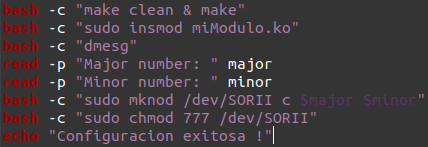
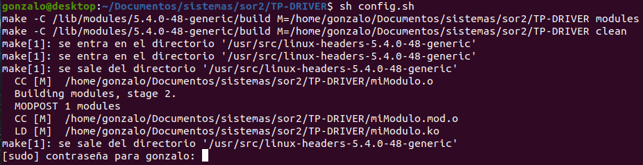
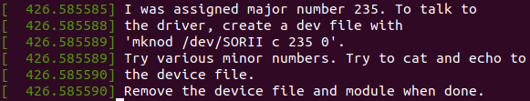
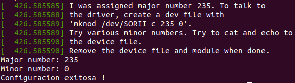
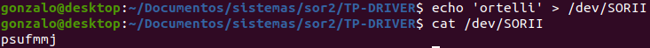
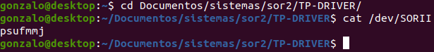

# Trabajo Practico Inicial de Sistemas Operativos y Redes II
## Device Drivers - Char Device

### config.sh : Es un script para automatizar la ejecucion de los comandos.

# Paso 1
### make clean & make : Se limpian todos los archivos que make creo anteriormente y se compila el codigo del modulo.

# Paso 2
### insmod & dmesg : Se carga el modulo, y se visualiza la ruta para crearlo, con su Mayor y Minor number. 

# Paso 3
### reads : Se ingresa el Major y Minor number obtenidos en el paso anterior. 
### mknod & chmod : Se crea el archivo SORII en /dev para poder utilizar el driver, y se le otorga permisos del tipo 777.

# Paso 4
### echo & cat : Se escribe el mensaje a guardar en ese modulo, el cual sera encriptado con Caesar, y luego se lo muestra (ya encriptado). 

# Extra
### Ingreso nuevamente para ver que sigue devolviendo el char almacenado.

